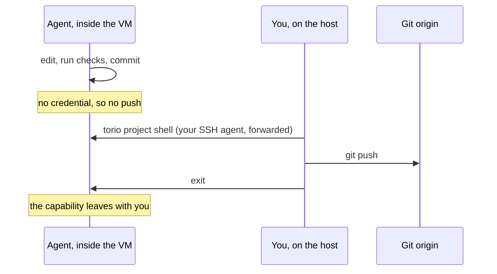

# Torio

[](https://github.com/wzslr321/torio/actions/workflows/ci.yml)
[](https://github.com/wzslr321/torio/releases)
[](LICENSE)

Agents work best with context and worst with credentials. Torio hands them one
and not the other.

One Go binary over [Lima](https://lima-vm.io) creates a Linux VM on your macOS
or Linux workstation, runs an agent backend inside it (Hermes as a guest
service, or Claude Code per session), attaches the repositories you name, and
keeps a private Markdown vault the agent can search. What it never puts there
is a credential: an agent that gets confused or prompt-injected reaches no
token of yours and no remote. It commits; you push, after reading what it did.

Torio is not the AI, not the VM, and not the chat window. It is the layer that
brings those into a known-good state and then gets out of the way. It has no
daemon and no state beyond one non-secret config file.


Documentation lives at **[torio.dev](https://torio.dev)**.

## The boundary

A permission prompt is a control inside the agent's own process. It can be
ignored, and in practice it is clicked through. Torio replaces it with
controls the agent cannot reach: an unprivileged identity with no `sudo`, a
closed group set, a binary it cannot rewrite, no credential that reaches a Git
remote, and the edge of a VM.

Write capability against a remote exists only inside a session you open, and
it leaves with you:



By default that session forwards your agent whole. Pin one identity as
`operator_key` in the config and it gets a mediated agent instead: the pinned
key alone, a dialog on the host before every signature (Deny is the default
and the cancel), and every decision recorded to `agent-audit.jsonl` before it
takes effect. With the pin set, `torio project agent <id> --push-grant` opens
an agent session that may *ask* to push: the same dialog, one signature at a
time, for exactly one invocation.

## Quick start

You need macOS on Apple Silicon or Linux on x86_64, with
[`limactl`](https://lima-vm.io) on your `PATH`. Torio refuses anything else.

Install a release. The installer verifies `SHA256SUMS` before the binary is
copied anywhere, and authenticates to nothing:

```bash
scripts/install.sh                     # into ~/.local/bin
```

or build from source: `go build -o torio ./cmd/torio`.

Then bring the stack up. Every step is idempotent.

```bash
torio vm init                          # pinned Lima template; no --force exists
torio vm start
torio vm bootstrap --timeout 10m       # install + verify the guest; drift fails closed

torio serve install --timeout 2m       # render + validate the systemd unit
torio serve start   --timeout 2m       # up when /api/status answers 200, not before

torio brain init                       # private Markdown vault, versioned, searchable
torio serve restart --timeout 2m       # pick up the Brain's retrieval skill

torio project add my-service https://github.com/you/my-service --use
```

A private repository takes the same command. For an SSH remote, `add` generates
a read-only deploy key on the guest and prints the public half; authorize it on
the forge and run the same command again. Torio keeps no copy of the private
half, and a remote the guest cannot read still fails closed.

The backend binds `127.0.0.1:9119` inside the VM. Torio adds no tunnel
feature; you open the forward yourself:

```bash
ssh -F ~/.lima/torio/ssh.config -L 19119:127.0.0.1:9119 -N -f \
    -o ExitOnForwardFailure=yes lima-torio
```

Point Hermes Desktop at `http://127.0.0.1:19119`, set the session token, pick
a provider, and work. The token and provider steps are in
[`docs/runbooks/first-run.md`](docs/runbooks/first-run.md).

## The daily loop

`torio serve status` is the one command to remember: it reports the systemd
unit, the loopback endpoint and the Hermes version.

Once you run more than one box, `torio status` is the other one. It polls every
box Torio owns and gives you a row each: whether it is running, what its agent
has going, whether anything there is waiting on you, and when it last did work.
Fields it cannot prove say so, with `?` for a question it could not answer and
`—` for one that backend does not answer at all.

```console
$ torio status
INSTANCE           BOX      BACKEND      SESSION  WAITING           PROGRESS
torio              running  hermes       —        ?                 24s
torio-claude-code  running  claude-code  1        yes 3m pid 11673  —
```

It exits 0 whatever it finds, so a status bar can call it on a timer.
`torio status setup tmux` prints the block that does that; `torio status setup
zsh` prints the prompt equivalent, collapsed to one chip per box.

Work happens in the checkouts: from Desktop, from your own editor, or from
`torio project enter <id>`. Edit, run checks that read rather than write,
review `git diff`. When you decide something should leave the VM:

```bash
torio project shell my-service         # your SSH agent, forwarded for this session
git commit && git push
exit                                   # the capability leaves with you
```

Every command takes `--json` and emits a single machine-readable document on
stdout; flags, exit codes and each command's contract are in the
[reference](https://torio.dev/reference.html).

## What Torio will not do

- **Hold your Git or model-provider credentials.** Git write arrives only as
  your forwarded SSH agent in a session you opened: mediated, when you pin an
  `operator_key`, so no signature happens without you. MCP OAuth is the deliberate
  exception: an interactive login stores it under the separate `torio-mcp`
  guest identity, never under the agent uid or on the host.
- **Expose the backend.** It remains loopback-only inside the VM; its working
  tunnel is yours to open and close. MCP login opens only its fixed loopback
  OAuth callback forward and closes it with the command.
- **Write history.** No commit, push, merge, tag, or release. The persistent
  backend reads only.
- **Take data out.** Import brings a vault in; there is no export. Copying the
  Brain back out is a `limactl copy` you run yourself.
- **Delete anything.** It never re-images or removes a VM, and removing a
  project leaves its checkout on disk.
- **Run agents for you.** No task queue, no dispatcher, no autonomous workers.
- **Grant MCP tools implicitly.** `torio mcp install` ships the broker and relay,
  but policy is a root-owned, exact list written by the operator. OAuth begins
  only with `torio mcp login <service>`, and the broker refuses tools outside
  the verified grant.
- **Stop an agent leaking what it has read.** The trust boundary is the edge
  of the VM; the threat model covers prompt injection and a confused agent,
  not an adversarial one. Data exfiltration is unsolved and DNS is an accepted
  covert channel. [`SECURITY.md`](SECURITY.md) says exactly what is claimed.

## Which agent runs inside

One VM runs one agent identity, and a second backend means a second VM, never
a second agent inside one: two identities would contend over the same
checkouts.

You do not track which VM that is. `--backend` names the agent and Torio finds
its box: the default one is `torio`, the rest are `torio-<backend>`.

| | `hermes` (default) | `claude-code` |
| --- | --- | --- |
| Shape | a guest service on loopback | a per-session process |
| Reached by | a client through a tunnel you open | `torio project agent <id>` |
| Project registry | yes, driven by Torio | none; a project is a directory |
| Pinned by | an upstream commit | a version, checksum-verified |

```bash
torio vm init --backend claude-code
torio vm start --backend claude-code
torio vm bootstrap --backend claude-code --timeout 10m
torio backend login --backend claude-code       # the box gets its own grant
torio project add demo --backend claude-code    # already attached elsewhere? clone it here
torio project agent demo --backend claude-code  # the agent works here
torio project shell demo --backend claude-code  # you review, and push
```

The project registry is shared, so `demo` is attached once and `project list`
says the same thing whichever backend you select. The checkouts are not shared
and cannot be (each is owned by one guest identity), so `project add <id>`
with no remote is the step that gives a backend its own working tree, from the
remote already on record. What passes between the two trees is what you push.

`TORIO_INSTANCE` still names a box directly, for a test VM or a second box
running the same backend.

MCP uses the same custody boundary on both backends. Write one strict policy
document per service as `root:root 0644`, then install, authorize, and verify:

```bash
torio mcp install --backend claude-code
torio mcp login atlassian --backend claude-code
torio mcp status --backend claude-code
```

The backend launches a credential-free stdio relay. OAuth state belongs to the
separate `torio-mcp` uid, and the broker exposes only tools present in both the
root-owned grant and upstream discovery. Claude Code's route is root-managed;
Hermes' agent-owned config remains a drift detector, while the socket and policy
are the enforcement boundary. See
[ADR-0013](docs/adr/0013-mcp-managed-client-config-and-activation.md).

## The Second Brain

The VM also keeps a private Markdown vault: versioned, searchable, and read by
the backend's retrieval skill. The vault has a written standard of its own,
and it ships as a plugin you can install into Claude Code with no VM under it
at all:

```
/plugin marketplace add wzslr321/torio
/plugin install brain-kit@torio
/brain-kit:init
```

That gives you the vault, its format, and its rituals: capture, inbox triage,
daily notes, meetings, people, retrieval. It works against a directory of notes
you already have; a note without frontmatter stays valid to read, so nothing is
rewritten on arrival.

[`brainkit/evals/`](brainkit/evals/README.md) hands an agent a fixture vault and
checks what it actually did, including whether it leaves the vault alone when
the task has nothing to do with it.

The plugin gives you no boundary: those are instructions to a model running on
your workstation with your permissions. Same standard, same vault shape, either
way: [`brainkit/README.md`](brainkit/README.md) and
[`brainkit/STANDARD.md`](brainkit/STANDARD.md).

## Supported hosts

| Host | VM type | Guest |
| --- | --- | --- |
| macOS / Apple Silicon | `vz` | `aarch64` |
| Linux / x86_64 | `qemu` | `x86_64` |

Both pin the same Ubuntu build by digest, so the two hosts do not run
measurably different guests. An unsupported host is refused up front, not deep
inside the first command that needs a pin. A row lands only after something has
booted it.

## Roadmap

Where it is going, roughly in order:

- **More hosts.** arm64 Linux is one table row plus an image digest away; it
  waits on someone booting and verifying it, not on design.
- **Editor integration.** A Neovim panel already ships in
  [`integrations/neovim`](integrations/neovim/README.md): `:Torio` lists
  projects, opens routine or push-capable terminals, reports health, and shows
  Hermes sessions. It is not packaged for a plugin manager yet, and no other
  editor has an equivalent.

If one of these is yours, [`CONTRIBUTING.md`](CONTRIBUTING.md) has the how and
[`AGENTS.md`](AGENTS.md) has the boundaries no change may cross.

## Documentation

- **[torio.dev](https://torio.dev)**: tutorials, how-to guides, the full
  command reference, and the reasoning, organised by
  [Diátaxis](https://diataxis.fr).
- [`docs/runbooks/first-run.md`](docs/runbooks/first-run.md): the complete
  first run, every command in order.
- [`brainkit/STANDARD.md`](brainkit/STANDARD.md): what a Torio vault is: the
  note types, the naming, the links, and what an agent may do to it.
- [`brainkit/evals/`](brainkit/evals/README.md): the behavioural benchmark that
  measures whether an agent holding the kit actually behaves that way, and the
  reports it has produced.
- [`docs/adr/`](docs/adr/README.md): the accepted decisions. Why the VM is the
  trust boundary, why write capability is operator-carried, why the egress
  allowlist was rejected.
- [`SECURITY.md`](SECURITY.md), [`CONTRIBUTING.md`](CONTRIBUTING.md),
  [`CHANGELOG.md`](CHANGELOG.md).

The site and the runbooks are generated from [`docs/content/`](docs/content/)
by [`scripts/build_docs.py`](scripts/build_docs.py). Edit sources, never
outputs: `make docs && make validate`.

MIT. See [LICENSE](LICENSE).
