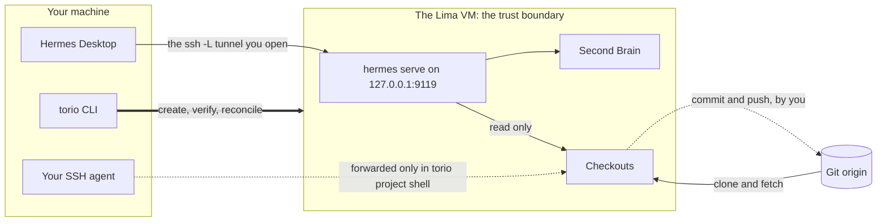

# Torio

[](https://github.com/wzslr321/torio/actions/workflows/ci.yml)
[](https://github.com/wzslr321/torio/releases)
[](LICENSE)

Your AI second brain, on a Linux VM you actually control.

Torio is a thin control plane over [Lima](https://lima-vm.io): one Go binary
that creates a VM on your macOS or Linux workstation, runs the Hermes backend
as a service on the guest's own loopback, keeps a private Markdown Second
Brain, and attaches the repositories you name. It has no daemon, no state
beyond one non-secret config file, and no credentials at all.

The narrowness is the point. Torio is not the AI, not the VM, and not the chat
window. It is the layer that brings those three into a known-good state and
then gets out of the way. Everything that writes stays in your hands: the
commit, the push, the tunnel, the credential.

Documentation lives at **[torio.dev](https://torio.dev)**.

## How it fits together



The dashed edges are the whole design. The persistent backend has read access
to your checkouts and nothing more: it cannot push, and no credential of yours
is stored anywhere it could reach. Write capability against a remote exists
only inside a `torio project shell` session, which forwards your own SSH
agent, lasts exactly as long as you keep it open, and takes the capability
with it when you exit.

## Quick start

You need macOS on Apple Silicon or Linux on x86_64, with
[`limactl`](https://lima-vm.io) on your `PATH`. Torio refuses anything else
rather than creating a VM it could never verify.

Install a release. The installer resolves the latest stable version, verifies
`SHA256SUMS` before the binary is copied anywhere, and authenticates to
nothing:

```bash
scripts/install.sh                     # into ~/.local/bin
```

or build from source: `go build -o torio ./cmd/torio`.

Then bring the stack up. Every step is idempotent: rerunning a finished setup
changes nothing and exits `0`.

```bash
torio vm init                          # pinned Lima template; no --force exists
torio vm start
torio vm bootstrap --timeout 10m       # install + verify the guest; drift fails closed

torio serve install --timeout 2m       # render + validate the systemd unit
torio serve start   --timeout 2m       # up when /api/status answers 200, not before

torio brain init                       # private Markdown vault, versioned, searchable
torio serve restart --timeout 2m       # pick up the Brain's retrieval skill

torio project add my-service https://github.com/you/my-service --use
```

For a private repository, grant the guest read access yourself before
`project add`. Torio never stores or prompts for a credential, so a remote the
guest cannot already read fails closed.

The backend binds `127.0.0.1:9119` inside the VM. Torio adds no tunnel
feature, so network exposure is never a side effect of running a command. You
open the forward yourself:

```bash
ssh -F ~/.lima/torio/ssh.config -L 19119:127.0.0.1:9119 -N -f \
    -o ExitOnForwardFailure=yes lima-torio
```

Point Hermes Desktop at `http://127.0.0.1:19119`, set the session token, pick
a provider, and work. The token and provider steps, and the full verification
story behind every command above, are in
[`docs/runbooks/first-run.md`](docs/runbooks/first-run.md).

## The daily loop

`torio serve status` is the one command to remember: it reports the systemd
unit, the loopback endpoint and the Hermes version, so a backend that stopped
answering names itself instead of leaving you to guess.

Work happens in the checkouts: from Desktop, from your own editor, or from
`torio project enter <id>`. Edit, run checks that read rather than write,
review `git diff`. When you decide something should leave the VM:

```bash
torio project shell my-service         # your SSH agent, forwarded for this session
git commit && git push
exit                                   # the capability leaves with you
```

Every command takes `--json` and emits a single machine-readable document on
stdout; flags, exit codes and each command's contract are in the
[reference](https://torio.dev/reference.html).

## What Torio will not do

- **Hold credentials.** It never stores, prompts for, or reads one. The one it
  forwards is your SSH agent, into a session you opened.
- **Open a tunnel.** The backend is loopback-only inside the VM; the forward
  is yours to open and close.
- **Write history.** No commit, push, merge, tag, or release. The persistent
  backend reads only.
- **Take data out.** Import brings a vault in; there is no export. Copying the
  Brain back out is a `limactl copy` you run yourself.
- **Delete anything.** It never re-images or removes a VM, and removing a
  project leaves its checkout on disk.
- **Run agents for you.** No task queue, no dispatcher, no autonomous workers.
- **Broker MCP traffic yet.** `torio mcp install` provisions a credential
  custody boundary (a dedicated guest identity, a private credential home, a
  root-owned policy directory) and `torio mcp status` verifies it without
  repairing it. Nothing carries traffic yet; see the roadmap.
- **Stop an agent leaking what it has read.** The trust boundary is the edge
  of the VM; the threat model covers prompt injection and a confused agent,
  not an adversarial one. Data exfiltration is unsolved and DNS is an accepted
  covert channel. [`SECURITY.md`](SECURITY.md) says exactly what is claimed.

## Supported hosts

| Host | VM type | Guest |
| --- | --- | --- |
| macOS / Apple Silicon | `vz` | `aarch64` |
| Linux / x86_64 | `qemu` | `x86_64` |

Both pin the same Ubuntu build by digest, so the two hosts do not run
measurably different guests. An unsupported host is refused once, up front,
not deep inside the first command that needs a pin. This table is read as a
guarantee, so a row lands only after something has actually booted it.

## Roadmap

Torio does less than it will. Where it is going, roughly in order:

- **A real MCP broker.** `torio mcp` provisions custody today; the daemon that
  would carry traffic is unbuilt, blocked on decisions worth making well:
  upstream transport and OAuth lifecycle, recorded in
  [ADR-0004](docs/adr/0004-mcp-credential-custody-and-egress.md).
- **More hosts.** arm64 Linux is one table row plus an image digest away; it
  waits on someone booting and verifying it, not on design.
- **Backends beyond Hermes.** Nothing in the boundary (a loopback service,
  read-only checkouts, operator-carried write) is Hermes-specific. The backend
  contract should say so in code.
- **Editor integration, Neovim first.** Your own editor over SSH works today;
  a first-class flow does not exist yet.

If one of these is yours, [`CONTRIBUTING.md`](CONTRIBUTING.md) has the how and
[`AGENTS.md`](AGENTS.md) has the boundaries no change may cross.

## Documentation

- **[torio.dev](https://torio.dev)**: tutorials, how-to guides, the full
  command reference, and the reasoning, organised by
  [Diátaxis](https://diataxis.fr).
- [`docs/runbooks/first-run.md`](docs/runbooks/first-run.md): the complete
  first run, every command in order.
- [`docs/adr/`](docs/adr/README.md): the accepted decisions. Why the VM is the
  trust boundary, why write capability is operator-carried, why the egress
  allowlist was rejected.
- [`SECURITY.md`](SECURITY.md), [`CONTRIBUTING.md`](CONTRIBUTING.md),
  [`CHANGELOG.md`](CHANGELOG.md).

The site and the runbooks are generated from [`docs/content/`](docs/content/)
by [`scripts/build_docs.py`](scripts/build_docs.py); generated files are
committed, and the site deploys to torio.dev straight from `site/` with no
build step. Edit sources, never outputs: `make docs && make validate`. This
README is not generated; edit it directly.

MIT. See [LICENSE](LICENSE).
