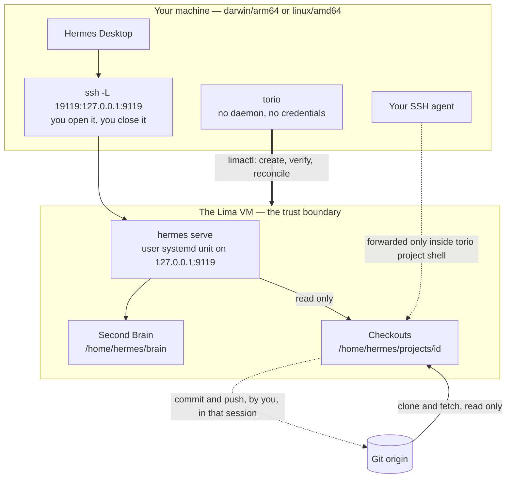

# Torio

Torio is a thin, trusted control plane for running an AI second brain and your
coding projects on a Linux VM, on macOS or Linux.

Torio is not the AI, not the VM, and not the chat window. It is the layer that
brings those three into a known-good state and then gets out of the way. It has
no daemon, holds no state of its own beyond a non-secret config file, and holds
no credentials at all.

The narrowness is the point. Torio creates and verifies the VM, runs the Hermes
backend as a service on the guest's own loopback, keeps a private Markdown
Second Brain, attaches the repositories you name, and prepares a separate MCP
credential boundary. Everything that writes — a commit, a push, a tunnel, a
credential — stays in your hands, and the sections below say so in detail rather
than in a disclaimer.

## Contents

- [What Torio does](#what-torio-does)
- [How a day with it goes](#how-a-day-with-it-goes)
- [Getting started](#getting-started)
- [Command surface](#command-surface)
- [Global flags](#global-flags)
- [Exit codes](#exit-codes)
- [What Torio does not do](#what-torio-does-not-do)
- [Supported hosts](#supported-hosts)
- [Going deeper](#going-deeper)

## What Torio does

- **Creates and reconciles the VM.** A Lima instance built from a pinned
  template, verified rather than trusted: architecture, image digest, ownership,
  modes, group membership, and the absence of any host mount. Drift fails
  closed with remediation instead of being quietly repaired.
- **Runs the Hermes backend as a service.** A user systemd unit bound to the
  guest's own loopback at `127.0.0.1:9119`, validated with `systemd-analyze`
  before it is ever activated, and proven ready by an actual `200` from
  `/api/status` — not by a clean exit code.
- **Keeps a private Second Brain.** A Markdown vault at `/home/hermes/brain`,
  versioned by its own Git repository and registered with Hermes as a project,
  so any session can search it. An existing vault can be imported through
  verified staging; there is no export.
- **Attaches the repositories you name.** Each one clones into
  `/home/hermes/projects/<id>`, a path derived from its id and never supplied by
  you, gets shared access for you and the `hermes` service identity, and is
  registered with Hermes. The model sees the projects you registered and no
  others. Nothing is discovered or scanned.
- **Prepares a separate MCP credential boundary.** `torio mcp install`
  provisions a dedicated guest identity, a private credential home, a client
  group, and a root-owned policy directory. `torio mcp status` verifies that
  boundary without repairing it.

## How a day with it goes

Once the VM and the backend are up they stay up. A day is: open the tunnel if it
is not already open, work in a checkout, and — only when you decide something
should leave the VM — open a session that can push and close it again.



The dashed edges are the whole design. The persistent backend has read access to
your checkouts and nothing more: it cannot push, and no credential of yours is
stored anywhere it could reach. Write capability against a remote exists only
inside a `torio project shell` session, which forwards your own SSH agent, lasts
exactly as long as you keep it open, and takes the capability with it when you
exit. Torio never test-pushes to prove the session works, and once you exit it
makes no claim about what you pushed — check the remote yourself.

The loop, whichever editor or interface you use:

1. Work in a checkout — from a Desktop session, your own editor, or
   `torio project enter <id>`.
2. Edit, or let your AI tool edit, files there.
3. Run a check that reads rather than writes.
4. Review what changed: `git diff` and `git status`.
5. Decide whether any of it should leave the VM.
6. If it should: `torio project shell <id>`, commit, push, exit.

`torio serve status` is the one command to remember. It reports the systemd unit,
the loopback endpoint and the Hermes version, so a backend that stopped answering
names itself instead of leaving you to guess.

## Getting started

Every step below is idempotent. Rerunning the sequence on a finished setup
changes nothing and exits `0`.

### Before you start

- A supported host with `limactl` on your `PATH`: macOS on Apple Silicon, or
  Linux on x86_64. Torio refuses to run anywhere else rather than creating a VM
  it could never verify.
- A Go toolchain, if you build the CLI rather than installing a release asset.
- For each repository you plan to attach: read access that already works from the
  guest, without a prompt. Provisioning it is yours to do, outside Torio.

Torio creates the VM itself, so there is nothing to provision by hand first.

### 1. Install the CLI

From a checkout, install a published release asset. The installer resolves the
latest stable release, verifies `SHA256SUMS` before the binary is copied
anywhere, and installs into `~/.local/bin` by default. It needs a published
release to exist; before one does, build from source below:

```bash
scripts/install.sh                       # latest stable release
scripts/install.sh --version X.Y.Z       # or a specific one, without the leading v
```

`install.sh` authenticates to nothing and never will — an installer carrying a
forwarded token would be the one exception that makes the credential-neutral
claim untrue. Where the assets are not readable anonymously, fetch them with a
tool that does hold your credentials and point the installer at what you fetched;
checksum verification is identical on both paths:

```bash
gh release download vX.Y.Z -D /tmp/torio-rel
scripts/install.sh --version X.Y.Z --base-url file:///tmp/torio-rel
```

To build from source instead, put the result on your `PATH` so every documented
command works as written:

```bash
go build -o torio ./cmd/torio
sudo install -m 755 torio /usr/local/bin/torio
```

### 2. Create and verify the VM

```bash
torio vm init
torio vm start
torio vm bootstrap --timeout 10m
```

`init` creates the pinned Lima instance, or succeeds idempotently when a
compatible one already exists; an incompatible instance fails closed, and there
is no `--force`. `start` confirms a `Running` post-state. `bootstrap` installs
the pinned Hermes Agent when the launcher is missing and then verifies the guest:
the `hermes` user, the `torio-projects` group and its members, that `hermes` is
**not** in the `docker` group, the guest architecture against the host profile,
`hermes --version` and `git --version`, the profile, Brain and workspace paths on
a native Linux filesystem with the expected owner, group and mode, and the
absence of any broad host mount. Any drift fails closed with exit `6` and
remediation.

Hermes Agent install can be slow, so give it room. `10m` is the policy maximum
for a single operation, and asking for more is refused before any work starts.

### 3. Bring up the loopback backend

```bash
torio serve install --timeout 2m
torio serve start   --timeout 2m
torio serve status
```

`install` renders and validates the unit before activation and does not start the
backend. `start` fails closed unless systemd reports active **and**
`GET /api/status` answers `200` through loopback.

### 4. Open your own tunnel

The backend binds `127.0.0.1:9119` inside the VM. Torio adds no tunnel feature,
so network exposure is never an accident of running a command. Derive the forward
from the live Lima SSH config:

```bash
ssh -F ~/.lima/torio/ssh.config -L 19119:127.0.0.1:9119 -N -f \
    -o ExitOnForwardFailure=yes lima-torio
curl -s -m 5 -o /dev/null -w '%{http_code}\n' http://127.0.0.1:19119/api/status
```

You should get `200`. Tear the tunnel down by killing the `ssh` process holding
the forward.

### 5. Create the Second Brain

```bash
torio brain init
torio brain status
```

`init` builds the scaffold atomically through private guest staging, makes the
first local commit, registers the Hermes project, and installs the global
`torio-brain` retrieval skill. It configures no remote and pushes nothing. It
refuses to touch non-empty data it did not create, so an existing vault is never
silently absorbed. If the backend was already running, restart it — Hermes caches
the assembled skills prompt in the backend process, so reconnecting a client is
not enough.

To bring an existing Markdown vault in, preflight first — `--dry-run` transfers
nothing:

```bash
torio brain import ~/path/to/vault --dry-run
torio brain import ~/path/to/vault
```

### 6. Attach a repository

```bash
torio project add my-service https://github.com/you/my-service --use
torio project list
```

`add` clones the exact remote into the derived path, gives you and `hermes`
shared access, and registers the project with Hermes before it records anything
in config. A remote the guest cannot already read without prompting fails closed
with exit `7`; the fix is to grant the guest read access yourself, on the guest,
not to rerun the command. Nothing on the guest is reset or deleted, so a failed
`add` is finished by a rerun rather than restarted.

### 7. Connect Hermes Desktop

Point Desktop at `http://127.0.0.1:19119`, the host end of your forward.
Non-public `/api/*` routes are gated behind an `X-Hermes-Session-Token` header,
and headless `serve` renders no page for a client to read one from — so you pin a
token yourself, in a systemd drop-in on the guest, and paste the same value into
Desktop. Torio generates no token, because it handles no secrets. The exact
procedure, including why the token is typed rather than pasted from a ready-made
block, is step 5 of the runbook:
[`docs/runbooks/first-run.md`](docs/runbooks/first-run.md).

Selecting a model and configuring a provider are manual human steps beyond this
sequence.

## Command surface

Every parent command (`vm`, `serve`, `brain`, `project`, `mcp`) takes no action
itself; an absent or unknown subcommand is a usage error.

| Command | What it does |
| --- | --- |
| `torio vm init` | Create the VM from the pinned template, or succeed idempotently when a compatible instance exists. Sizing at creation only: `--cpus N`, `--memory SIZE`, `--disk SIZE` (defaults 4, `8GiB`, `60GiB`). |
| `torio vm status` | Report the Torio VM state. Answers `not_found` before `init`, and exits `0`. |
| `torio vm start` | Start the VM. Idempotent; confirms a `Running` post-state. |
| `torio vm stop` | Stop the VM. Graceful and idempotent; never uses `--force`, never removes the VM or its data, and requires a `Stopped` post-state. |
| `torio vm bootstrap` | Reconcile and verify the existing target for Hermes. Installs the pinned Hermes Agent when the launcher is missing. Idempotent on a reconciled target; any drift is exit `6`. |
| `torio vm ssh -- COMMAND…` | Run one command inside the VM. Opens no interactive shell and forwards neither stdin nor a TTY. |
| `torio serve install` | Generate, validate with `systemd-analyze`, and enable the backend user service. Idempotent; does not start it. |
| `torio serve start` | Start the backend and prove loopback readiness. |
| `torio serve stop` | Stop the backend service. |
| `torio serve restart` | Restart the backend and prove loopback readiness. |
| `torio serve status` | Report systemd state and loopback endpoint readiness. |
| `torio serve logs` | Show recent, bounded, redacted, unit-scoped journal entries. Accepts `--lines N`. |
| `torio brain init` | Create the Brain scaffold through private guest staging, make the first local commit, register the Hermes project, and install the `torio-brain` retrieval skill. Configures no remote. |
| `torio brain status` | Report Brain state, path, filesystem, ownership and mode, Git worktree state, aggregate counts, registration, and skill state. Changes nothing. |
| `torio brain import <host-directory>` | Import an existing Markdown vault through private staging, verified by checksum on the guest. `--into SUBDIR` lands it as one contained subtree; `--dry-run` preflights without transferring anything. |
| `torio project add <name> <remote>` | Clone the exact remote into the derived workspace path, or verify and adopt a checkout already there; grant shared access; register with Hermes before recording it in config. `--id SLUG` picks an id other than `<name>`; `--use` makes it active. |
| `torio project list` | List the registered projects. Reads config only, runs nothing on the guest, and works with the VM stopped. |
| `torio project show <id>` | Report the registry entry, checkout state, and Hermes registration. Reports drift as stable markers; returns no filenames, diffs, or raw Git output. |
| `torio project use <id>` | Make a registered project the active Hermes project. |
| `torio project remove <id>` | Archive the Hermes project and drop the config entry. The checkout is never deleted, and the output says where it still is. |
| `torio project enter <id>` | Open an ordinary interactive terminal in the checkout, with agent forwarding and connection multiplexing disabled. |
| `torio project shell <id>` | Open an ephemeral operator session in the checkout with your SSH agent forwarded. The capability ends when you exit. Not bounded by `--timeout`. |
| `torio mcp install` | Provision the unprivileged `torio-mcp` identity, its private `0700` home, the `torio-mcp-clients` group, and the root-owned policy directory, then verify the boundary. A settled rerun reports `changed:false`. |
| `torio mcp status` | Verify the identity, group, home, policy, Hermes-profile and runtime invariants without repairing them. Drift is a verification failure. |
| `torio version` | Print the version, commit, build date and Go toolchain of the binary you are running. |

That is the whole leaf surface: 25 commands.

Both `mcp` subcommands report the grant they verified — every service in
`/etc/torio-mcp/policy.d/`, its upstream endpoint, how many tools it allows and
how many of those write. Nothing about a service is built into the CLI: a service
is a policy document, and adding one means writing a second file as root.

## Global flags

Four flags are registered on the root command and apply everywhere.

| Flag | What it does |
| --- | --- |
| `--json` | Emit a single machine-readable JSON document on stdout. Human logs always go to stderr, so the two never interleave. The interactive commands (`project enter`, `project shell`) have no document to emit, and asking for one there is a usage error rather than a silently ignored flag. |
| `--verbose` | Emit more redacted diagnostics on stderr. It moves the log level from warn to debug; it never adds anything to stdout. |
| `--timeout` | Bound a single operation. Default `30s`; the policy maximum is `10m`, and a larger value is refused before any work starts. A `default_timeout` in the config document applies only when the flag was not given — an explicit flag always wins. |
| `--config` | Path to an explicit non-secret config file, instead of the XDG path. It applies to the project registry exactly as it does to everything else. |

## Exit codes

The mapping is a contract, not an implementation detail. `0` is success,
including idempotent success.

| Code | Meaning |
| --- | --- |
| `1` | Uncategorized internal error. Deliberately outside the contract's error classes. |
| `2` | Usage or schema-validation error — a missing argument, an invalid config, `torio` with no subcommand. |
| `3` | Unmet precondition — a stopped VM, an absent Brain, an unsupported host. |
| `5` | Conflict — an id or remote already taken. |
| `6` | Verification failure — bootstrap drift, or a backend that is active but whose endpoint is dead. |
| `7` | Permission or capability denial — including a remote the guest cannot read without prompting. |
| `8` | External dependency failure — a missing `limactl`, or Hermes or Git unavailable. |
| `9` | Reconciliation required. |

`4` is unused. It meant "policy denied" in an earlier design that is no longer in
the tree, and reusing the number would silently change what an existing `4`
meant.

## What Torio does not do

- **It holds no credentials.** It never stores, prompts for, or reads one, and
  never causes a credential prompt. A remote the guest cannot already read
  without prompting fails closed; granting that access is yours to do, on the
  guest, outside Torio.
- **It opens no tunnel.** The backend is loopback-only inside the VM. You open
  the SSH forward yourself, so network exposure is never a side effect of
  running a command.
- **It writes no history.** No commit, push, merge, tag, or release. The
  persistent backend has read access only. When you decide to push,
  `torio project shell` forwards your own SSH agent into a session that ends
  when you exit it.
- **It takes no data out.** Import brings a vault in; there is no export.
  Copying the Brain back to your machine is a `limactl copy` you run yourself,
  which Torio neither performs nor verifies nor calls a backup.
- **It deletes nothing.** It never re-images or removes a VM, and forgetting a
  project leaves its checkout on disk.
- **It is not an agent platform.** No task queue, no dispatcher, no autonomous
  workers.
- **It does not broker MCP traffic yet.** The released CLI provisions custody
  only. It does not install or activate the dormant broker, run OAuth, or send
  requests to an upstream MCP service.
- **It does not stop an agent leaking what it has read.** The trust boundary is
  the edge of the VM, and the threat model covers prompt injection and a confused
  agent — not an adversarial one. Data exfiltration is unsolved and DNS is an
  accepted covert channel. See
  [`docs/03-architecture.md`](docs/03-architecture.md) and
  [`SECURITY.md`](SECURITY.md).

## Supported hosts

| Host | Lima VM type | Guest architecture |
| --- | --- | --- |
| `darwin/arm64` | `vz` | `aarch64` |
| `linux/amd64` | `qemu` | `x86_64` |

Both pin the same Ubuntu build by digest, so the two supported hosts do not run
measurably different guests. An unsupported host is refused once, up front, with
exit `3` — not deep inside the first command that needs a pin, after you have
already been told to install Lima and create a VM that could never verify.

Intel Macs are absent on purpose: `vz` requires Apple Silicon, and a
`darwin/amd64` host would have to run an emulated guest. arm64 Linux is absent
because it is unproven here, not because it is impossible — adding it is one row
plus a digest, but a row nothing has ever booted is a claim, and this table is
read as a guarantee.

## Going deeper

- [`docs/runbooks/first-run.md`](docs/runbooks/first-run.md) — the full first run
  with every command in order, including the session-token and provider steps
  this page summarizes.
- [`site/`](site/) — a static, Diátaxis-organised documentation site: plain HTML
  and one CSS file, no runtime dependency. The complete first run is on one page,
  [`site/tutorials.html`](site/tutorials.html); the command reference is
  [`site/reference.html`](site/reference.html). It is prepared for deployment on
  **Vercel**, but **deployment is pending**: no Vercel project and no `torio.dev`
  domain are connected or configured by this repository.
- [`docs/adr/`](docs/adr/README.md) — the accepted architecture decisions,
  including why the VM is the trust boundary, why write capability is
  operator-carried, and why the destination egress allowlist was rejected.
- [`AGENTS.md`](AGENTS.md) — the governing work contract for contributors and
  agents: the fixed boundaries, the security invariants, and what Torio must not
  implement.
- [`SECURITY.md`](SECURITY.md) — what the project claims, what it accepts, and
  how to report a vulnerability privately.
- [`CONTRIBUTING.md`](CONTRIBUTING.md) — branch and commit rules, the test
  suites, and the review checklist.
- [`CHANGELOG.md`](CHANGELOG.md) — release-level changes, with detailed notes per
  release under [`docs/releases/`](docs/releases/v0.3.0.md).

### One source, two outputs

The site pages **and** the runbook are generated by
[`scripts/build_docs.py`](scripts/build_docs.py) from Markdown sources in
[`docs/content/`](docs/content/). A section used in more than one place — pinning
the session token, say — is a single file in `docs/content/blocks/` included by
each, so the site and the runbook cannot disagree.

```bash
make docs         # regenerate site/*.html and docs/runbooks/*.md
make validate     # fail if any generated file drifted from its source
```

Generated files are committed, so serving the site still needs no build step.
Edit the sources, never the outputs — see [`CONTRIBUTING.md`](CONTRIBUTING.md).
This README is not generated; edit it directly.
