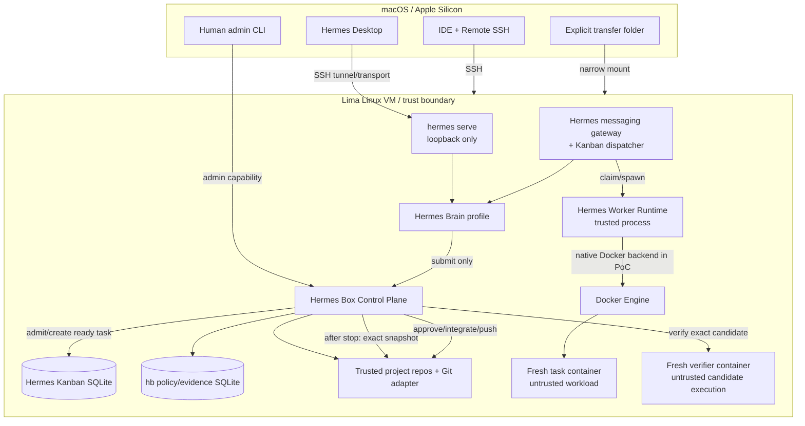

# Architektura

## Widok systemowy



## Trust zones

### Zone A — macOS

Zawiera UI i człowieka. Agent runtime nie ma szerokiego dostępu do hosta. Jedyny stały mount to jawny transfer folder.

### Zone B — trusted VM runtime

Zawiera Hermes Brain, gateway, Kanban, control plane, Git repos i Docker Engine. Administrator VM jest częścią TCB. W Demo B również proces Hermes Worker Runtime jest częścią TCB, ponieważ natywny backend wywołuje Docker na hoście.

### Zone C — untrusted workload

Task i verifier containers wykonują model-generated commands oraz candidate code. Nie mają host credentials, Docker API, innych repo ani host-side tools.

## Control flow

### Remote Brain

```text
Desktop → SSH → loopback hermes serve → Brain profile
Messaging adapter → gateway → Brain profile
```

`serve` i gateway są osobnymi procesami/lifecycle. Gateway jest instalowany natywnym `hermes gateway install`. `serve` potrzebuje własnej user service Hermes Box, jeśli zainstalowana wersja CLI obsługuje `serve`; spike definiuje compatibility path.

### Coding task

```text
Brain/human submit
→ HB admission validates trusted project + request
→ resolve effective policy from registry/trusted base
→ snapshot policy
→ prepare exact workspace
→ create/admit Hermes Kanban task
→ native dispatcher spawns worker profile
→ worker runtime routes file/terminal to fresh task container
→ worker produces candidate files and completes Kanban attempt
→ HB stops container and revokes writes
→ trusted Git adapter creates review commit/tree
→ fresh verifier checks exact snapshot
→ human reviews and approves exact evidence
→ fast-forward integrate if target still equals base
→ explicit separate push
```

## Admission boundary

Brain nie może tworzyć gotowych do dispatchu coding tasks z arbitralną policy. Wersja docelowa udostępnia narrow `submit` tool/API. Control plane:

1. waliduje project ID i request schema,
2. odrzuca żądane rozszerzenie capability,
3. rozwiązuje effective policy,
4. przygotowuje workspace,
5. dopiero wtedy publikuje/admituje task do execution boardu.

W pierwszym Demo B submit może być ręczny, ale architektura nie może uzależniać bezpieczeństwa od promptu Braina.

## State ownership

- Hermes Kanban: intent, assignee, queue status, retries, run history, comments.
- `hb.db`: project binding, effective policy, execution resources, candidate, verification, approval, integration i push.
- Git: base/review/tree OIDs i refs.
- Docker: zasób wykonawczy, nigdy źródło prawdy.

`hb` po restarcie reconciliuje ledger z Git/Docker/Hermes; nie odtwarza stanu z nazw kontenerów na ślepo.

## Deployment evolution

### Demo B TCB

```text
Hermes Worker Runtime + HB + Docker adapter = trusted
Task container = untrusted
```

### Hardening

```text
HB owns Docker
Hermes worker has no Docker access
Hermes worker connects to task container through SSH/narrow executor API
```

Ta ewolucja ma zachować ten sam `Executor` interface i evidence contract.
